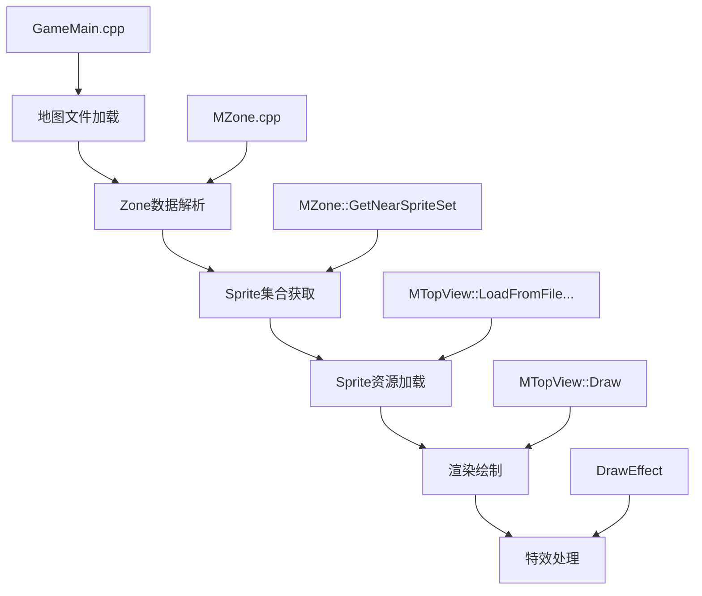

## 地图加载到渲染流程分析

### 整体流程概览

地图加载到渲染的流程主要涉及地图文件解析、Sprite资源加载、渲染绘制和特效处理四个阶段。



### 1. 地图文件解析

地图加载入口在 `GameMain.cpp` 的 `LoadZone` 函数中，根据地图大小选择加载大区域或小区域 [1](#0-0) [2](#0-1) 。

关键步骤：
- 释放旧的Sprite资源
- 创建新的 `MZone` 对象
- 调用 `MZone::LoadFromFile` 解析地图文件
- 获取玩家位置附近的Sprite集合

### 2. Sprite获取过程

`MZone::GetNearSpriteSet` 函数负责获取指定坐标范围内的Sprite ID集合 [3](#0-2) ：

- 扫描地图扇区(Sector)
- 收集Tile Sprite ID
- 收集ImageObject Sprite ID（包括动画帧的Sprite ID）

然后通过 `MTopView::LoadFromFileTileAndImageObjectSet` 加载具体的Sprite资源 [4](#0-3) 。

### 3. Sprite绘制流程

`MTopView` 类包含多个绘制函数 [5](#0-4) ：

- `DrawTileSurface()` - 绘制地表
- `DrawZone()` - 绘制区域
- `DrawCreature()` - 绘制生物
- `DrawImageObject()` - 绘制图像对象
- `DrawEffect()` - 绘制特效

Sprite的实际绘制通过 `CSprite` 类的 `Blt` 系列方法实现 [6](#0-5) ，支持透明度处理和裁剪。

### 4. 特效处理系统

特效处理主要通过以下方式实现：

1. **Sprite特效**：通过 `CSpriteSurface::SetEffect` 设置特效类型 [7](#0-6) 
   - `EFFECT_SIMPLE_OUTLINE` - 简单轮廓
   - `EFFECT_WIPE_OUT` - 渐隐效果

2. **Alpha混合特效**：`CAlphaSpritePack` 处理带透明度的Sprite [8](#0-7) 

3. **渐变特效**：通过 `memcpyEffectGradation` 实现渐变效果 [9](#0-8) 

### 关键文件总结

| 功能 | 文件 | 主要职责 |
|------|------|----------|
| 地图加载 | `GameMain.cpp` | 地图文件加载流程控制 |
| 地图解析 | `MZone.cpp` | 地图数据解析和Sprite ID收集 |
| Sprite管理 | `MTopView.h/cpp` | Sprite资源加载和管理 |
| Sprite绘制 | `CSprite.cpp` | 底层Sprite绘制实现 |
| 特效处理 | `MTopViewDraw.cpp` | 高级特效绘制 |

## Notes

- 地图系统支持大区域(LargeZone)和小区域(SmallZone)两种加载模式
- Sprite资源采用延迟加载策略，只加载玩家附近的资源
- 特效系统支持多种视觉效果，包括轮廓、渐隐、渐变等
- 整个渲染流程基于2D Sprite引擎，使用DirectDraw进行硬件加速

### Citations

**File:** Client/GameMain.cpp (L2415-2502)
```cpp
		else
		{
			// Load�� Zone�� ����(size)�� ���
			g_nZoneSmall = n;	

			DEBUG_ADD("[Load Zone] Release Old Tile&ImageObject SPK");
			
			// ���� Zone�� �ִ� Sprite���� �����ش�.
			g_pTopView->ReleaseTileSPKSmallZone();		
			g_pTopView->ReleaseImageObjectSPKSmallZone();	
			
			// SmallZone�� �ʱ�ȭ�Ѵ�.
			if (g_pZoneSmall != NULL)
			{
				DEBUG_ADD( "Delete old ZoneSmall");
				
				delete g_pZoneSmall;
			}				

			DEBUG_ADD( "New ZoneSmall");
			
			g_pZoneSmall = new MZone;

			// SmallZone�� pointer�� ����
			g_pZone	= g_pZoneSmall;

			// ƾ�����ΰ�� ƾ������ ������ �ε�
			MString filename = pZoneInfo->Filename;
			if(g_pUserInformation->GoreLevel == false)
			{
				if(pZoneInfo->TeenFilename.GetLength() > 0)
					filename = pZoneInfo->TeenFilename;
			}

			class ifstream file;
			if (!FileOpenBinary(filename, file))
			{
				// priority�� ��������
				if (g_pLoadingThread!=NULL)
				{
					g_pLoadingThread->SetPriority( THREAD_PRIORITY_LOWEST );
				}

				return FALSE; 
			}

			DEBUG_ADD("[Load Zone] Load Zone Data");
			
			UI_DrawProgress( 80 );

			// Zone loading ����?
			if (!g_pZone->LoadFromFile( file ))
			{
				SetMode( MODE_QUIT );

				// priority�� ��������
				if (g_pLoadingThread!=NULL)
				{
					g_pLoadingThread->SetPriority( THREAD_PRIORITY_LOWEST );
				}
				return FALSE;
			}

			g_pZone->SetCurrentZoneID( n );
		
			//g_pTopView->LoadFromFileTileSPKLargeZone( file );	// tile�� load
			//g_pTopView->LoadFromFileImageObjectSPKLargeZone( file );
			file.close();			
			
			
			
			UI_DrawProgress( 90 );

			//-------------------------------------------------------
			// Player�� ��ǥ ��ó�� Sprite���� Load�Ѵ�.
			//-------------------------------------------------------
			DEBUG_ADD("[Load Zone] Find Tile&ImageObject ID");
			
			CSpriteSetManager TileSSM;
			CSpriteSetManager ImageObjectSSM;
			g_pZone->GetNearSpriteSet(TileSSM, ImageObjectSSM, g_pPlayer->GetX(), g_pPlayer->GetY());
			g_pTopView->LoadFromFileTileAndImageObjectSet(TileSSM, ImageObjectSSM);

			DEBUG_ADD("[Load Zone] Find Tile&ImageObject ID.. OK");
			
			UI_DrawProgress( 95 );
		}
		
```

**File:** Client/GameMain.cpp (L2634-2718)
```cpp
		else
		{
			// Load�� Zone�� ����(size)�� ���
			g_nZoneLarge = n;	

			DEBUG_ADD("[Load Zone] Release Old Tile&ImageObject SPK");
			
			// ���� Zone�� �ִ� Sprite���� �����ش�.
			g_pTopView->ReleaseTileSPKLargeZone();		
			g_pTopView->ReleaseImageObjectSPKLargeZone();	
			
			// LargeZone�� �ʱ�ȭ�Ѵ�.
			if (g_pZoneLarge != NULL)
			{
				DEBUG_ADD( "Delete old ZoneLarge");
				
				delete g_pZoneLarge;
			}			
			
			DEBUG_ADD( "New ZoneLarge");
			
			g_pZoneLarge = new MZone;

			// LargeZone�� pointer�� ����
			g_pZone	= g_pZoneLarge;			
			
			// ƾ�����ΰ�� ƾ������ ������ �ε�
			MString filename = pZoneInfo->Filename;
			if(g_pUserInformation->GoreLevel == false)
			{
				if(pZoneInfo->TeenFilename.GetLength() > 0)
					filename = pZoneInfo->TeenFilename;
			}
			
			class ifstream file;
			if (!FileOpenBinary(filename, file))
			{
				// priority�� ��������
				if (g_pLoadingThread!=NULL)
				{
					g_pLoadingThread->SetPriority( THREAD_PRIORITY_LOWEST );
				}

				return FALSE; 
			}

			DEBUG_ADD("[Load Zone] Load Zone Data");
			
			UI_DrawProgress( 80 );

			// Zone loading ����?
			if (!g_pZone->LoadFromFile( file ))
			{
				SetMode( MODE_QUIT );

				// priority�� ��������
				if (g_pLoadingThread!=NULL)
				{
					g_pLoadingThread->SetPriority( THREAD_PRIORITY_LOWEST );
				}

				return FALSE;
			}

			//g_pTopView->LoadFromFileTileSPKLargeZone( file );	// Tile�� load
			//g_pTopView->LoadFromFileImageObjectSPKLargeZone( file );
			file.close();

			UI_DrawProgress( 90 );
			
			//-------------------------------------------------------
			// Player�� ��ǥ ��ó�� Sprite���� Load�Ѵ�.
			//-------------------------------------------------------
			DEBUG_ADD("[Load Zone] Find Tile&ImageObject ID");
			
			CSpriteSetManager TileSSM;
			CSpriteSetManager ImageObjectSSM;
			g_pZone->GetNearSpriteSet(TileSSM, ImageObjectSSM, g_pPlayer->GetX(), g_pPlayer->GetY());
			g_pTopView->LoadFromFileTileAndImageObjectSet(TileSSM, ImageObjectSSM);
			
			DEBUG_ADD("[Load Zone] Find Tile&ImageObject ID.. OK");
				
			UI_DrawProgress( 95 );
		}

```

**File:** mingw/MZone.cpp (L5201-5279)
```cpp
	if (sY2 >= m_Height)
	{
		sY2 = m_Height-1;
	}
		
	DEBUG_ADD_FORMAT("GetNearSpriteSet: (%d, %d) ~ (%d, %d)", sX1, sY1, sX2, sY2);

	//------------------------------------------------------
	// �� Sector�� ImageObject�˻�
	//------------------------------------------------------
	int y,x,i;

	int maxTile = g_pTopView->m_TileSPK.GetSize();

	for (y=sY1; y<=sY2; y++)
	{				
		for (x=sX1; x<=sX2; x++)
		{				
			const MSector& sector = m_ppSector[y][x];

			//--------------------------------------------
			// Tile SpriteID�� �����Ѵ�.
			//--------------------------------------------
			int spriteID = sector.GetSpriteID();

			if (spriteID < maxTile)
			{
				TileSSM.Add( spriteID );
			}

			//--------------------------------------------
			// ImageObject�� �ִٸ�.. 
			//--------------------------------------------
			if (sector.IsExistImageObject())
			{
				OBJECT_MAP::const_iterator iImageObject = sector.GetImageObjectIterator();

				//--------------------------------------------				
				// Sector�� �ִ� ��� ImageObject���� �˻��Ѵ�.
				// �� ImageObject�� SpriteID�� ��� �߰��Ѵ�.
				//--------------------------------------------
				for (i=0; i<sector.GetImageObjectSize(); i++)
				{
					MImageObject* const pImageObject = (MImageObject* const)((*iImageObject).second);
					
					if (pImageObject->GetSpriteID() != SPRITEID_NULL)
					{
						ImageObjectSSM.Add( pImageObject->GetSpriteID() );
					}
					
					// Frame�� �ִ� ���... Frame�� SpriteID�� �˻� 
					if (pImageObject->IsAnimation())
					{
						DEBUG_ADD_FORMAT("AnimationObject: (%d, %d)",x, y);

						int fid = ((MAnimationObject*)pImageObject)->GetFrameID();

						if(fid < g_pTopView->m_ImageObjectFPK.GetSize())
						{
							FRAME_ARRAY* pFrameArray = &(g_pTopView->m_ImageObjectFPK[ fid ]);
							
							// �� Frame���� SpriteID�� �˻��Ѵ�.
							for (int j=0; j<pFrameArray->GetSize(); j++)
							{
								if ((*pFrameArray)[j].GetSpriteID() != SPRITEID_NULL)
								{
									ImageObjectSSM.Add( (*pFrameArray)[j].GetSpriteID() );
								}
							}
						}
					}
					
					
					iImageObject++;
				}
			}
		}
	}
}
```

**File:** Client/MTopView.h (L157-157)
```text
		bool		LoadFromFileTileAndImageObjectSet(const CSpriteSetManager &TileSSM, const CSpriteSetManager &ImageObjectSSM);
```

**File:** mingw/MTopView.h (L425-450)
```text
		void		DrawTileSurface();
		void		DrawZone(int X,int Y);
		void		DrawInformation();		
		void		DrawEventString(int &strX, int &strY);			// �̺�Ʈ �޴������� ��Ʈ������ ������ �κ��� ������ ȭ�鿡 ����ִ� �Լ�
		int			DrawChatString(POINT* pPoint, MCreature* pCreature, COLORREF color, BYTE flag=0);
		void		DrawItem(POINT* pPoint, MItem* pItem);
		void		DrawItemShadow(POINT* pPoint, MItem* pItem);
		void		DrawImageObject(POINT* pPoint, MImageObject* pImageObject);
		void		DrawAttachEffect(POINT* pPoint, ATTACHEFFECT_LIST::const_iterator iEffect, BYTE size, MCreature* pCreature, int type=0);
		void		DrawGroundEffect();
		void		DrawEffect(POINT* pPoint, MEffect* pEffect, bool bSeletable);
		void		DrawItemBroken(int x, int y);
		void		DrawPartyHP(POINT* pPoint, MCreature* pCreature);
// 		void		DrawBox3D(RECT* pRect, WORD pixel);			
		void		DrawFade();

		//------------------------------------------------------
		// Character Draw �Լ���... by sonee   2003.6
		//------------------------------------------------------
		void		DrawCreature(POINT* pPoint, MCreature* pCreature);		
		void		DrawCreatureShadow(POINT* pPoint, MCreature* pCreature);
		void		DrawCreatureName(MCreature* pCreature);
		void		DrawCreatureMyName();
		void		DrawCreatureHPModify(POINT *point, MCreature* pCreature);
		void		DrawUndergroundCreature(POINT *pPoint, MCreature *pCreature);

```

**File:** mingw/SpriteLib/CSprite.cpp (L3186-3285)
```cpp
	for (i=pRect->top; i<rectBottom; i++)
	{
		pPixels = m_Pixels[i];
		pDestTemp = pDest;		

		// (������,�����,�����)�� �ݺ� ��
		count = *pPixels++;		

		// �� �� ���		
		index = 0;
		
		//---------------------------------------------
		// �� �ٸ��� Clipping�� ����� �ϴµ�...
		// xxxxOOOOOOOOOOOOOO�� ����̹Ƿ�..
		//---------------------------------------------
		// xxxx�κб��� check���ִ� ��ƾ
		//---------------------------------------------
		if (count > 0)
		{
			j = count;
			do 
			{
				transCount = *pPixels++;		// ������ ��			
				colorCount = *pPixels++;		// ���� �ƴ� �� ��			
						
				// ��������ŭ index����			
				index += transCount;
				
			
				//---------------------------------------------
				// xxxx������ �Ѿ�� �Ǵ� ���
				//---------------------------------------------
				if (index+colorCount > rectLeft)
				{
					//---------------------------------------------
					// ������������ xxxx������ �Ѿ�� ���
					//---------------------------------------------
					if (index > rectLeft)
					{	
						// �������κ� �dzʶ�
						pDestTemp += (index - rectLeft)*scale;

						// �̹� �ܰ�� ��� ���
						CSpriteSurface::memcpyScale(pDestTemp, pitch, pPixels, colorCount);
						pDestTemp += (colorCount*scale);
						pPixels += colorCount;

						// �������ʹ� ��� ����Ѵ�.
						break;
					}
					//---------------------------------------------
					// ������+�����ƴѻ��� �Ϻα��� ����ϸ� 
					// xxxx������ �Ѿ�� �Ǵ� ���
					//---------------------------------------------
					else
					{
						dist = rectLeft - index;

						// ������ �ƴ� ������ Surface�� ����Ѵ�.
						CSpriteSurface::memcpyScale(pDestTemp, pitch, pPixels+dist, colorCount-dist);
						pDestTemp += (colorCount-dist)*scale;
						pPixels += colorCount;

						// �������ʹ� ��� ����Ѵ�.
						break;
					}
				}					

				// ������ �ƴ� ����ŭ index����				
				pPixels += colorCount;
				index += colorCount;
			} while (--j);

			//---------------------------------------------
			// �������ʹ� ��� ����Ѵ�.		
			//---------------------------------------------		
			if (--j > 0)
			{
				do 
				{
					transCount = *pPixels++;		// ������ ��			
					colorCount = *pPixels++;		// ���� �ƴ� �� ��			
							
					// ��������ŭ �dz� �ڴ�.
					pDestTemp += transCount*scale;			
					
					// �������� �ƴѸ�ŭ ������ش�.
					CSpriteSurface::memcpyScale(pDestTemp, pitch, pPixels, colorCount);

					// memory addr ����
					pDestTemp += colorCount*scale;
					pPixels += colorCount;			
				} while (--j);
			}
		}
			

		pDest = (WORD*)((BYTE*)pDest + pitch*scale);
	}
}
```

**File:** mingw/SpriteLib/CSprite.cpp (L4297-4298)
```cpp
						CSpriteSurface::memcpyEffectGradation(pDestTemp, pPixels, colorCount);
						pDestTemp += colorCount;
```

**File:** mingw/MTopViewDraw.cpp (L2091-2102)
```cpp
					CSpriteSurface::SetEffect( CSpriteSurface::EFFECT_SIMPLE_OUTLINE );
					
					m_pSurface->BltSpriteEffect(&pointTemp, pSprite);
				}
				else
				{
					CSpriteSurface::s_Value1 = casketValue;
					
					CSpriteSurface::SetEffect( CSpriteSurface::EFFECT_WIPE_OUT );
					
					m_pSurface->BltSpriteEffect(&pointTemp, pSprite);
				}
```

**File:** mingw/SpriteLib/CAlphaSpritePack.cpp (L191-207)
```cpp
CAlphaSpritePack::LoadFromFile(ifstream& file)
{
	// memory���� map����
	Release();

	// file���� sprite ������ �о�´�.	
	file.read((char*)&m_nSprites, SIZE_SPRITEID);

	// memory��´�.
	Init(m_nSprites, CDirectDraw::Is565());

	// file�� �ִ� Sprite���� Load	
	for (TYPE_SPRITEID i=0; i<m_nSprites; i++)
	{			
		m_pSprites[i].LoadFromFile(file);	// Sprite ����
	}
}
```
